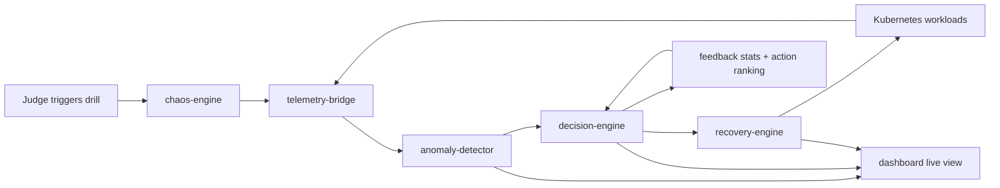

# AutoRemedy

Autonomous Chaos Engineering and Self-Healing Platform

This repository deploys a production-style microservice application on Kubernetes and wraps it with an autonomous control loop:

1. `chaos-engine` injects Kubernetes-native failures.
2. `telemetry-bridge` pulls live metrics from Prometheus and error signals from Loki.
3. `anomaly-detector` scores live telemetry with a cached `IsolationForest` and classifies incidents with a learned decision tree when enough labeled samples exist.
4. `decision-engine` maps anomalies to remediation plans with dynamic fault attribution and anti-flapping cooldowns.
5. `recovery-engine` executes recovery through the Kubernetes API.
6. `dashboard` visualizes anomaly scores, decisions, and recovery timelines in real time.



## Microservices

- `api-gateway`: public checkout API
- `user-service`: user profile source of truth in PostgreSQL
- `order-service`: order orchestration, HTTP + gRPC client
- `inventory-service`: gRPC stock manager backed by Redis
- `payment-service`: payment authorizer in PostgreSQL
- `recommendation-service`: Redis-backed product recommendations

## Failure modes

- Pod crashes via pod deletion
- Resource pressure via Kubernetes `Job`
- Network partitions via `NetworkPolicy`
- Latency injection via deployment patch and rolling restart
- Cyber attack drills for DDoS, MITM, XSS, clickjacking, and CSRF

## Recovery actions

- Deployment restart
- Manual scale-out, designed to coexist with HPA
- Service selector rerouting
- Cache restore and warmup
- Network policy rollback
- Latency reset
- DDoS rate limiting and burst scaling
- mTLS enforcement and certificate rotation
- WAF tightening, frame-policy enforcement, and mutation lockdown

## Quick start

```bash
python3 -m venv .venv
source .venv/bin/activate
pip install -r requirements.txt
./scripts/migrate.sh
./scripts/bootstrap_kind.sh
./scripts/build_images.sh
./scripts/load_images.sh
./scripts/deploy.sh
./scripts/demo.sh
```

The bootstrap script downloads `kind` and `kubectl` into `.bin/`. The deploy path expects Docker access and outbound network access to fetch base container images.
`./scripts/demo.sh` now runs a 60-second live demo loop by default, and it also supports `./scripts/demo.sh all`, `./scripts/demo.sh attacks`, or `./scripts/demo.sh faults` to walk judges through multiple scenarios while they watch the dashboard at `http://localhost:8080`.

## Telemetry APIs

- `GET /features/latest`: latest aggregate sample
- `GET /features/history`: rolling aggregate history
- `GET /features/per-service`: latest metrics broken down by service label
- `GET /slo/status`: per-service SLO compliance, active violations, and burn-rate estimate

Each telemetry sample now includes a `per_service` object so the anomaly detector and decision engine can attribute failures to the most degraded workload.
Security telemetry is also merged into the same samples, including `requests_per_ip_per_second`, `unique_source_ips`, `connection_count`, `syn_flood_score`, `tls_handshake_failures`, `certificate_mismatch_count`, `xss_attempt_count`, `clickjack_attempt_count`, `csrf_attempt_count`, and `blocked_attempt_count`.

## Dynamic Attribution And Cooldowns

- The decision engine derives targets from per-service telemetry:
  - `pod_instability`: highest restart count
  - `latency_spike`: highest p95 latency
  - `availability_regression`: highest error rate or lowest availability
  - `application_error_burst`: most Loki errors
- If per-service data is missing, the original hardcoded fallbacks are still used.
- Repeated recoveries are suppressed for the same `(classification, target)` pair during `COOLDOWN_SECONDS` seconds. Default: `60`.
- `MAX_RETRIES_PER_TARGET` caps repeated remediation attempts for the same `(classification, target)` pair before the engine suppresses further retries.
- `CIRCUIT_BREAKER_THRESHOLD` opens a temporary circuit after repeated failed recoveries, and `CIRCUIT_BREAKER_SECONDS` controls how long the target stays blocked before retrying.

## Per-Service Detection

- The anomaly detector now scores both the aggregate cluster signal and the latest per-service feature vectors.
- Events include `target_service` and `service_scores`, so the decision engine can target the degraded deployment directly.
- `GET /scores/per-service` returns the recent ranked per-service anomaly scores.
- `GET /model/metrics` returns anomaly-rate, retraining sizes, and a rolling drift score against the persisted baseline mean vector.

## Playbooks

- Remediation actions can now be overridden without code changes through `config/playbooks.yaml`.
- `PLAYBOOK_PATH` points to the YAML file to load. Default: `/app/config/playbooks.yaml`.
- Playbook templates can interpolate `{target}` and `{classification}` into action payloads.
- Default playbooks now cover `ddos_attack`, `mitm_attack`, `xss_attack`, `clickjacking_attack`, and `csrf_attack`.
- When multiple actions are available for the same classification, the decision engine now reorders them with a lightweight epsilon-greedy bandit using recent remediation outcomes from `GET /feedback`.

## Security Loop

- `api-gateway` now applies per-IP sliding-window rate limiting, proxy-chain validation, XSS request inspection, always-on anti-clickjacking headers, and audit/notification hooks.
- `dashboard` now emits clickjacking and CSRF telemetry, serves strict security headers, and requires CSRF tokens on state-changing authenticated requests.
- `recovery-engine` can apply temporary security posture changes and automatically relax them once telemetry indicates the attack has subsided.
- `chaos-engine` exposes `ddos-simulation`, `mitm-simulation`, `xss-probe`, `clickjacking-probe`, and `csrf-probe` scenarios for closed-loop validation.
- `ddos-simulation` and `xss-probe` now inject synthetic security telemetry into the shared security store, so the anomaly detector can classify them and drive end-to-end remediation during a live demo.
- The platform also tracks newer attack families including AitM/TLS downgrade variants, session hijacking, credential stuffing, SQLi, supply-chain risk, and zero-day guard signals.
- `api-gateway` now emits HSTS and detects TLS downgrade headers, DNS/ARP spoof hints, rogue Wi-Fi markers, SQLi payloads, and supply-chain / zero-day guard headers.
- `dashboard` now tracks failed-login bursts for credential stuffing and binds active sessions to IP plus user-agent to surface session hijack signals.

## Alerting And Audit

- `anomaly-detector`, `decision-engine`, `recovery-engine`, and the dashboard now emit durable audit records into PostgreSQL through `platform_audit_log`.
- Rolling histories are also persisted through `platform_history_log`, so pod restarts no longer wipe telemetry, anomaly, decision, recovery, or chaos timelines.
- Best-effort webhook notifications are supported for anomaly detection, suppressed recoveries, executed recoveries, and failed recoveries.
- Notification delivery is queued with dedupe keys and retry backoff in PostgreSQL.
- Set `ALERTING_ENABLED=true` plus one or more of:
  - `ALERT_WEBHOOK_URL`
  - `ALERT_WEBHOOK_INFO_URL`
  - `ALERT_WEBHOOK_WARNING_URL`
  - `ALERT_WEBHOOK_CRITICAL_URL`
- Provider-specific channels are also supported:
  - `SLACK_WEBHOOK_URL`
  - `PAGERDUTY_EVENTS_URL` plus `PAGERDUTY_ROUTING_KEY`
  - `ALERTMANAGER_URL`
- `ALERT_MIN_SEVERITY` controls which notifications are sent. Default: `warning`.

## Chaos Scheduling

- `chaos-engine` can now run scheduled, multi-step experiments from `config/chaos-schedules.yaml`.
- Each experiment supports:
  - `interval_seconds`
  - ordered `steps` with `scenario` payloads and `wait_seconds`
  - `observe_seconds` before evaluating post-fault health
- Results are exposed from `GET /experiments` and can be triggered on demand with `POST /experiments/run`.
- Experiment evaluation checks current SLO health for the target service after the observation window.

## Feedback Metrics

- `GET /feedback` on `decision-engine` summarizes recent remediation success rate, suppression count, and per-classification execution outcomes.
- The same feedback data now feeds a lightweight reinforcement loop: action success history is converted into per-classification preferences, and multi-step remediations are dynamically reordered to favor the actions that have been working best while still exploring alternatives.

## Auth

- Dashboard mutations support either API keys or bearer JWTs with role claims.
- Configure JWT auth with:
  - `DASHBOARD_JWT_SECRET`
  - `DASHBOARD_JWT_ISSUER`
  - `DASHBOARD_JWT_AUDIENCE`
  - `DASHBOARD_OPERATOR_ROLE`
  - `DASHBOARD_ADMIN_ROLE`
- The operator console includes an optional bearer token input alongside the API key input.

## Tracing

- Lightweight trace-context propagation is now built in for HTTP and gRPC calls through `x-trace-id`, `x-span-id`, and `x-parent-span-id`.
- If `OTEL_EXPORTER_OTLP_ENDPOINT` is set and the OpenTelemetry packages are installed, services also export traces over OTLP, which works with Tempo or an OTLP-enabled Jaeger collector.
- The Kubernetes observability manifests now deploy Tempo and provision it into Grafana as a datasource.
- The default Grafana dashboard now includes SLO burn-rate and trace-correlated error panels.

## Dashboard Access Control

- Mutating dashboard routes now require API keys:
  - `DASHBOARD_OPERATOR_API_KEY`: allows manual recovery actions
  - `DASHBOARD_ADMIN_API_KEY`: allows recovery plus chaos injection
- The operator console includes `Actor name`, `API key`, and optional bearer token inputs and forwards them with manual actions for audit logging.
- The dashboard live view now includes SLO compliance and recent chaos experiment outcomes.

## ML Classification And Persistence

- The anomaly detector still uses rule-based classification on cold start.
- Once at least `CLASSIFIER_MIN_SAMPLES` labeled anomalies are available, it trains a lightweight `DecisionTreeClassifier` and uses that in preference to the rules.
- The `IsolationForest` is cached in memory and only retrained when at least `RETRAIN_INTERVAL` new samples have been added since the last training run.
- Models are persisted with `joblib` by default:
  - anomaly model: `/tmp/model.pkl`
  - classifier model: `/tmp/classifier.pkl`
- If model loading fails, the detector falls back to in-memory retraining and rule-based classification.

## Environment Variables

- `COLLECT_INTERVAL_SECONDS`: telemetry scrape cadence. Default: `2`
- `DETECT_INTERVAL_SECONDS`: anomaly detection cadence. Default: `2`
- `DECISION_INTERVAL_SECONDS`: decision loop cadence. Default: `2`
- `COOLDOWN_SECONDS`: per-target anti-flapping cooldown in the decision engine. Default: `60`
- `MAX_RETRIES_PER_TARGET`: max retries before suppression. Default: `3`
- `CIRCUIT_BREAKER_THRESHOLD`: consecutive failures before opening the circuit. Default: `3`
- `CIRCUIT_BREAKER_SECONDS`: circuit-open duration. Default: `300`
- `RETRAIN_INTERVAL`: minimum new samples before retraining cached models. Default: `10`
- `CLASSIFIER_MIN_SAMPLES`: labeled anomaly count required before ML classification is used. Default: `30`
- `MODEL_PATH`: persisted anomaly model path. Default: `/tmp/model.pkl`
- `CLASSIFIER_MODEL_PATH`: persisted classifier model path. Default: `/tmp/classifier.pkl`
- `BASELINE_STATS_PATH`: persisted baseline drift stats. Default: `/tmp/model-baseline.json`
- `PLAYBOOK_PATH`: remediation playbook YAML. Default: `/app/config/playbooks.yaml`
- `SLO_PATH`: service SLO YAML. Default: `/app/config/slos.yaml`
- `CHAOS_SCHEDULE_PATH`: chaos experiment YAML. Default: `/app/config/chaos-schedules.yaml`
- `CHAOS_SCHEDULE_POLL_SECONDS`: schedule polling cadence. Default: `5`
- `OTEL_EXPORTER_OTLP_ENDPOINT`: optional OTLP trace exporter endpoint for Tempo/Jaeger collectors
- `DASHBOARD_JWT_SECRET`: optional JWT verification secret for bearer-token auth
- `DASHBOARD_JWT_ISSUER`: optional expected JWT issuer
- `DASHBOARD_JWT_AUDIENCE`: optional expected JWT audience
- `DASHBOARD_OPERATOR_ROLE`: role claim granting recovery access. Default: `operator`
- `DASHBOARD_ADMIN_ROLE`: role claim granting chaos access. Default: `admin`
- `PLATFORM_RETENTION_DAYS`: audit/history/notification retention window. Default used by maintenance scripts and dashboard startup: `14`
- `TARGET_NAMESPACES`: namespaces monitored by the operator console and control plane. Default: `chaos-loop`
- `DDOS_RATE_LIMIT_PER_IP`: gateway requests-per-second limit before returning `429`. Default: `20`
- `DDOS_ATTACK_IP_RATE_THRESHOLD`: anomaly rule threshold for classifying DDoS. Default: `25`
- `DDOS_CONNECTION_COUNT_THRESHOLD`: anomaly rule threshold for volumetric traffic. Default: `150`
- `DDOS_UNIQUE_IP_RATIO_THRESHOLD`: anomaly rule threshold for distributed-source spikes. Default: `0.65`
- `DDOS_SYN_FLOOD_SCORE_THRESHOLD`: anomaly rule threshold for SYN-flood style traffic. Default: `0.4`
- `XSS_PATTERN_STRICTNESS`: gateway inspection mode. Default: `strict`
- `CSRF_TOKEN_TTL_SECONDS`: dashboard CSRF token lifetime. Default: `1800`
- `CREDENTIAL_STUFFING_THRESHOLD`: failed login attempts in the dashboard window before credential-stuffing telemetry is emitted. Default: `5`
- `SECURITY_WINDOW_SECONDS`: shared security telemetry rolling window. Default: `60`
- `SECURITY_POSTURE_COOLDOWN_SECONDS`: minimum hold time before auto-relaxing temporary mitigations. Default: `90`
- `EXPECTED_PUBLIC_HOSTS`: accepted external hosts for anti-downgrade / DNS-spoof checks. Default: `localhost,api-gateway,dashboard`

## Operations

- Run shared schema setup manually with `./scripts/migrate.sh`.
- Run retention cleanup manually with `./scripts/prune_history.sh`.
- The dashboard also runs migrations and a best-effort retention prune on startup.

## Dashboard

Port-forward the dashboard after deployment:

```bash
.bin/kubectl -n chaos-loop port-forward svc/dashboard 8080:8000
```

Then open `http://localhost:8080`.

## Notes

- The detector uses `IsolationForest` because it is lightweight enough to run continuously in-cluster.
- The detector caches and persists models so it does not retrain from scratch on every cycle.
- Loki ingestion is performed directly from the services through a lightweight HTTP log handler, which keeps the local setup smaller than a full Promtail deployment.
- The reroute action is implemented as a Kubernetes `Service` selector patch and is ready for blue/green or shadow lanes.

## Tests

Run the basic logic tests with:

```bash
python3 -m unittest discover -s tests
```
